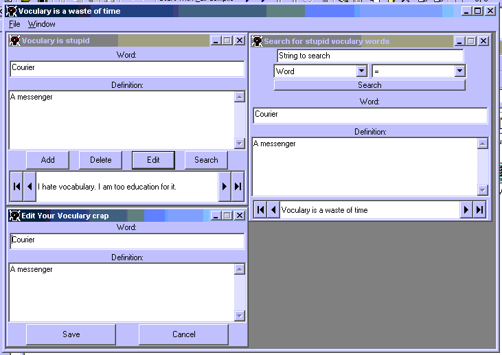



## Cool Database w/ edit and search features too

### Description

Good database program to learn from. I suggest getting it. It was one of my first database programs, and this makes it easy and stuff. Has add, delete, edit and search feature. Also uses SysGarbage.ocx for system tray access. It is cool. Please rate.
 
### More Info
 
it is cool. good to learn from.

You might get some error saying sysgarbage.ocx isn't there, so I included a batch file to copy and register SysGarbage.ocx

             |
---                |---
**Submitted On**   |2001-01-17 05:16:46
**By**             |[Jump0ffabuilding](https://github.com/Planet-Source-Code/PSCIndex/blob/master/ByAuthor/jump0ffabuilding.md)
**Level**          |Beginner
**User Rating**    |3.5 (14 globes from 4 users)
**Compatibility**  |VB 6\.0
**Category**       |[Databases/ Data Access/ DAO/ ADO](https://github.com/Planet-Source-Code/PSCIndex/blob/master/ByCategory/databases-data-access-dao-ado__1-6.md)
**World**          |[Visual Basic](https://github.com/Planet-Source-Code/PSCIndex/blob/master/ByWorld/visual-basic.md)
**Archive File**   |[CODE\_UPLOAD138541172001\.zip](https://github.com/Planet-Source-Code/jump0ffabuilding-cool-database-w-edit-and-search-features-too__1-14473/archive/master.zip)

